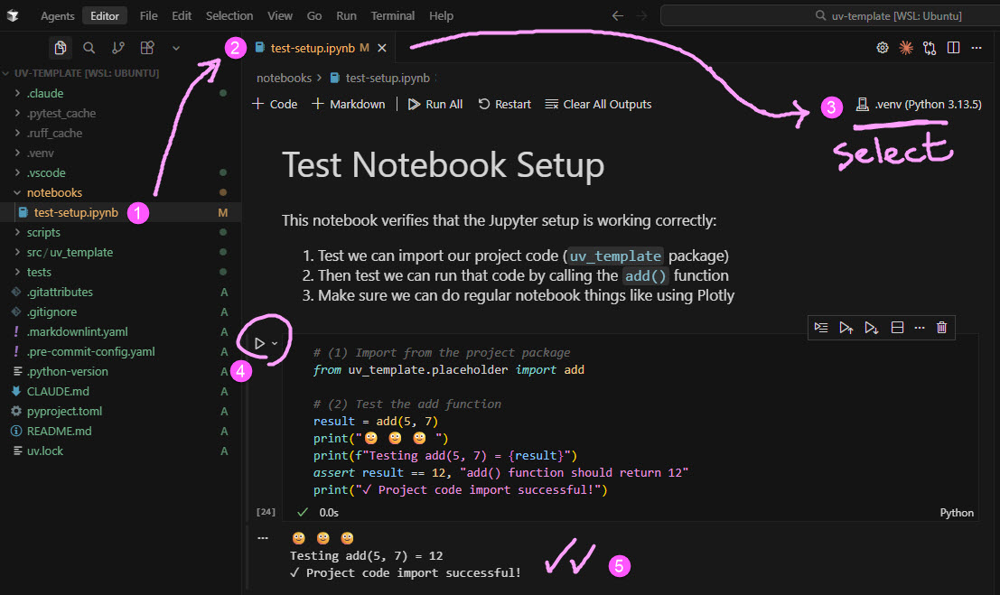

# UV Template for Python Projects

A [uv](https://docs.astral.sh/uv/)-based Python 3.13+ project template configured for test-driven development (pytest) and code quality checks (Ruff, Pyright running before each commit). Supports development in `src/` packages, standalone `scripts/`, and Jupyter `notebooks/`. Complete IDE setup included for VSCode/Cursor.

<div align="center">
  <a href="docs/notebook.jpg">
    
  </a>
  <p><em>Project Structure (left) with Jupyter Notebook (right)</em></p>
</div>

## 📁 Project Structure

Key project directories and files:

```
uv-template/
├── src/uv_template/           # Package source code
├── tests/                     # Test files mirroring src/ structure
├── notebooks/                 # Jupyter notebooks saving cleanly to Git
├── scripts/                   # Sometimes you want a standalone script
├── .vscode/                   # IDE settings and recommended extensions
├── .claude/                   # Claude Code settings and /commit command
├── pyproject.toml             # Project dependencies and tool configuration
├── uv.lock                    # Dependency versions (do not edit manually)
├── .pre-commit-config.yaml    # Checks that run before every commit for quality
├── .python-version            # Python version specification for uv
├── CLAUDE.md                  # Instructions for AI coding assistants
└── README.md                  # This file
```

## 📦 Installation

1. Pre-requisite: install the uv Python package manager [from here](https://docs.astral.sh/uv/getting-started/installation/)

2. Clone the repository to "my-project-name"

   ```bash
    git clone https://github.com/michellepace/uv-template.git my-project-name
   ```

3. Run these terminal commands for first-time setup:

    ```bash
    # Change directory into new project
    cd my-project-name

    # Install project dependencies (creates .venv/ directory)
    uv sync

    # Install pre-commit hooks (runs quality checks before each commit)
    uv run pre-commit install
    ```

4. Open "my-project-name" in your IDE and open a NEW terminal:
   - Run `which python` → should show ../.venv/bin/python (project virtual environment)
   - Run `uv run pre-commit run --all-files` → linting, type checking, and tests should pass

5. Install the recommended extensions from [.vscode/extensions.json](.vscode/extensions.json). (These are already configured in [.vscode/settings.json](.vscode/settings.json).)

## ✨ Customisation & Usage

1. Instruct AI (renaming): *Refactor this project to consistently rename it from "uv-template" to "agent-course-google" throughout, use `git mv` for renaming!*

2. Instruct AI (changes): *For any project structural changes (e.g., removing `scripts/`), ask AI to refactor consistently throughout.*

3. Use Jupyter notebooks (image above) normally and together with Claude Code

4. Review [CLAUDE.md](CLAUDE.md) for common uv commands and add your own project context
